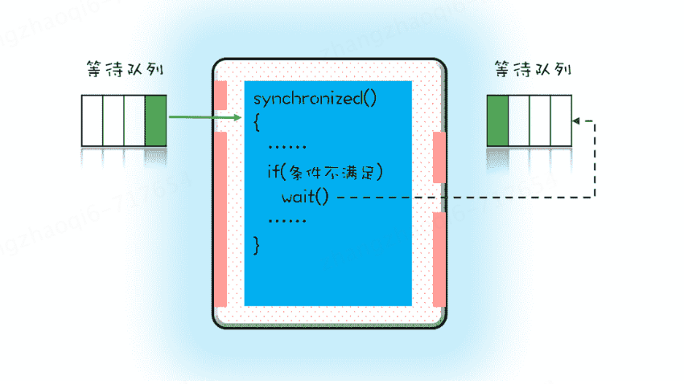

# wait-notify-notifyAll

Java内置的synchronized配合notify/notifyAll便可以实现多线程的等待-通知机制  

上图所示的是synchronized的等待队列示意图  
synchronized保护的是图中蓝色的临界区，当有多个线程同时需要访问临界区资源的时候会先进入到左侧的等待队列中等待。
**这个队列和互斥锁是一对一的关系，每个互斥锁都有自己独立的等待队列**  

当线程进入临界区后，由于某些执行临界区操作的条件不满足，这个时候线程需要重新挂起，释放锁，等待条件满足的时候在执行。  
为了满足上述的要求，便需要使用wait()方法，当调用wait()方法后当前线程会被阻塞，并且进入到右边的阻塞队列，这个等待队列也是互斥锁的等待队列。
线程在进入等待队列的时候会释放自己占有的互斥锁，线程释放锁后，其他线程就有机会获得锁，并进入临界区了。  

那当进入临界区后被阻塞的线程满足运行条件时，该怎么通知等待线程呢？使用notify/notifyAll方法。  
当条件满足时调用notify(),会通知等待队列(互斥锁的等待队列)中的线程，告诉他**当前时刻条件满足线程运行**  
为什么要着重说明是当前时刻？因为**notify()只能保证在通知的当前时间点，条件是满足的**。而被通知线程的执行时间点和通知时间点基本上是不会重合的，总是有一些时间差的，所以当线程执行的时候条件很可以又不满足了
所以一般线程从阻塞队列被唤醒后执行任务之前还需要再次判断一下是否满足当前线程执行的条件。这也是为什么能够经常看到在一些多线程场景中，比如生产者消费者模型中，线程执行时的条件判断代码都是使用 while() ...  

除此之外还需要主要，线程重新执行，仍然需要重新获取互斥锁。wait..notify的使用必须在synchronized代码块内，且该方法是锁自身的行为，使用的时候需要注意此时synchronized的锁对象是谁，比如是this，则调用方法
需要使用 this.wait(); this.notify();...  

