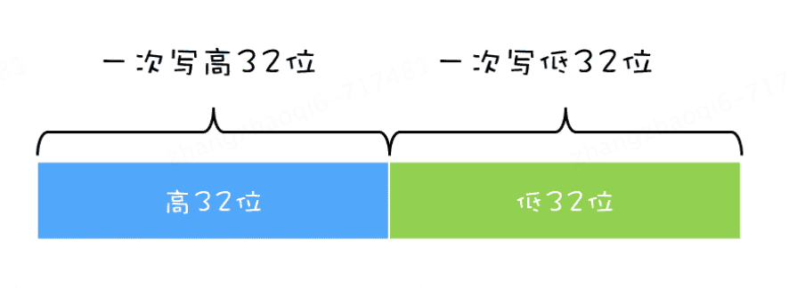

# 原子性问题应该如何解决？

原子性问题的源头是线程切换，而操作系统做线程切换依赖的是cpu中断，所以理论上禁用cpu发生中断就能够禁止线程切换，但是现代操作系统大多数为多核cpu，禁用线程中断无法避
免线程并发时对同一个变量有重复操作，于是便有了锁

1. 单核cpu：单核cpu时代只需要禁止cpu发生中断，不发生线程切换，让一个线程一直执行自己的任务直到任务完成即可，这个过程保证了一个任务的原子性
   比如在一个32位的cpu上执行long型变量的写操作为例：
   long型变量是64位，在32位的cpu上执行写操作会被拆分为两次写操作（写高32位和写低32位）
   
   在单核cpu场景下，同一时刻只有一个线程执行，禁止cpu中断，意味着操作系统不会重新调度线程，也就是禁止了线程切换，获得CPU使用权的线程就可以不间断的执行，所以两次写操作的执行一定是要都执行了要么都没执行
2. 多核cpu：但如果是多核cpu，在上述场景中结果又会不一样，多个线程可能同时在多个cpu中同时写入这个long变量，即使禁止了cpu中断，也禁止不了多个线程同时并发造成同一个变量的写入，这个时候就需
   要用到互斥锁，做到只有一个获得了这把锁的线程才能够进行写操作的目的

总结：原子性问题解决方案：单核时代禁用cpu中断就好，多核时代使用互斥锁

# Java提供的锁技术：synchronized

synchronized是Java 实现管程的一种方式，他能够自动加解锁，可以用来修饰方法，修饰代码块

```java
class X {
    // 修饰非静态方法
    synchronized void foo() {
        //临界区
    }

    // 修饰静态方法
    synchronized static void bar() {
        //临界区
    }

    //修饰代码块
    Object obj = new Object();

    void baz() {
        synchronized (obj) {
            //临界区
        }
    }
}
```

1. 当修饰静态方法时，锁定的是当前类的Class对象，在上面的例子中锁定的是Class X;
2. 当修饰非静态方法时，锁定的是当前实例对象 this
3. 修饰代码片段，锁定的是指定的对象

## 使用synchronized 解决 count+=1 问题

```java
class SafeCalc {
    long value = 0L;

    long get() {
        return value;
    }

    synchronized void addOne() {
        value += 1;
    }
}
```

上述代码无论多少个线程同时运行，在调用addOne方法的时候都只能有一个线程获取锁执行下方逻辑，所以一定能够保证原子性，那是否能够保证可见性呢？根据Happens-Before原则，对一个
锁的解锁Happens-Before 于后续对这个锁的加锁。所以，当前一个线程在临界区修改了共享变量（该操作在解锁前），对后续进入临界区（该操作在加锁后）的线程是可见的。按照这个规则，如果多个线程同时执行
addOne()方法，可见性是可以保证的，也就是说如果有1000个线程执行addOne()方法，最终结果一定是value的值增加1000

执行 addOne() 方法后，value 的值对 get() 方法是可见的吗？这个可见性是没法保证的。管程中锁的规则，是只保证后续对这个锁的加锁的可见性，而 get() 方法并没有加锁操作，所以可见性没法保证。那如何解决呢？   
很简单，就是 get() 方法也 synchronized 一下。  
get()方法和addOne()方法都需要访问value这个受保护的资源，这个资源用 this这把锁来保护。线程要进入临界区 get()和addOne()，必须先获取 this 这把锁，这样get()和addOne()也是互斥的  

# 总结
使用锁的关键：要明白何时用锁，锁是什么，锁的资源是什么
