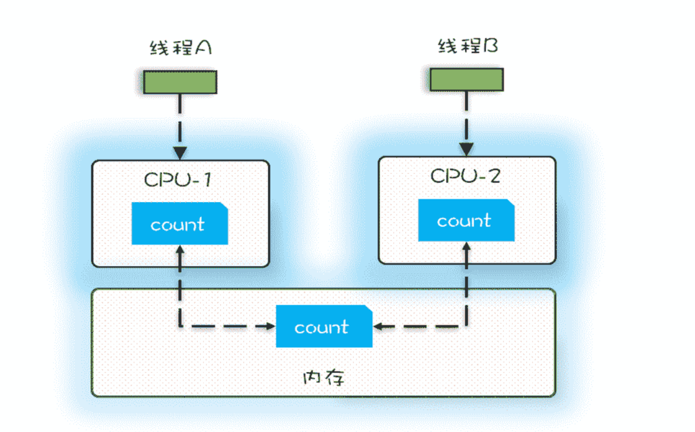

# 源头一：缓存导致的可见性问题

可见性的定义：一个线程对共享变量的修改另外一个线程能够立刻看到，我们称之为可见性。  
现代CPU架构都是多核的，每一个核都存在自己的缓存，计算数据时会先从缓存读取数据，如果缓存存在就会直接使用，如果缓存不存在才会从内存中读取。
上述运行规律可能会导致如下的可见性问题：  

当多个线程在多个cpu上执行时，这些线程操作的是不同的cpu缓存。比如上图，线程A操作的是CPU-1中的缓存，线程B操作的是CPU-2上的缓存，很明显，
这个时候线程A对变量V的操作对于线程B而言就不具备可见性了。  
这个时候如果线程A和线程B同时对一个共享变量进行操作，比如对变量的++操作，最终的结果就可能不符合预期了。

# 源头二：线程切换带来的原子性问题

操作系统任务的切换一般是发生在时间片（为了保证多线程并发执行cpu会给每个线程分配时间，比如分配50ms让当前线程执行任务，时间结束就是时间片结束）
结束的时候，然而线程切换的时候并不代表当前线程所执行的任务就完成了。现代编程语言都是高级语言，一个语句可能对应多个cpu指令，比如count
+=1操作，至少需要三条CPU指令。   
指令一：首先，需要把变量count从内存加载到CPU的寄存器  
指令二：之后，在寄存器中执行+1操作  
指令三：最后，将结果写入内存（缓存机制导致可能写入的是CPU缓存而不是内存）   
操作系统做任务切换可能发生在任何一个指令执行完的时候（注意是cpu指令，而不是高级语言里的一条语句）   
对于上述过程假设有两个线程同时对count进行操作   
期望的结果是线程1执行完之后线程2执行，最终返回的结果是2，但实际可能如下：  
A线程在指令一结束后线程发生了切换，此时寄存器中的count=0  
B线程一次执行完了所有的操作，此时内存中的count=1  
然后线程A又继续执行没有完成的指令，因为此时寄存器中的值为0，所以加一最后执行后存储到内存中的值还是1，最终结果还是1，不符合预期  

我们潜意识觉得count+=1 这个操作是一个不可分割的整体，像一个原子，但实际并不是，线程的切换是可能发生在count+=1中间时间的  
**我们把一个或者多个操作在 CPU 执行的过程中不被中断的特性称为原子性。CPU能保证的原子操作是CPU指令级别的，而不是高级语言的操作符**  
因此很多时候需要我们自己在高级语言的层面来保证操作的原子性  

# 源头三：编译优化带来的有序性问题  
编译器为了优化性能，有时候会改变程序的执行顺序，例如程序中：a=6；b=7，有可能最终被优化为b=7，a=6，在这个例子中顺序发生了变化，但是并不影响
最终的执行结果，但是有些情况却会带来意想不到的bug，典型的比如利用双重检查创建单例对象：   
```java
public class Singleton {
    static Singleton instance;

    static Singleton getInstance() {
        if (instance == null) {
            synchronized (Singleton.class) {
                if (instance == null) {
                    instance = new Singleton();
                }
            }
        }
        return instance;
    }
}
```
上述获取单例的方式采取了双层校验的方式，当线程A和线程B同时创建单例对象会在第一次if位置判断此时单例对象是否为空，如果为空两个线程竞争锁，其中一个
先创建单例对象，释放锁之后另一个线程需要再次判断单例对象是否存在，如果存在了就不再重复创建了。  
这样看来似乎代码也没有问题，但是仔细考虑，会发现如果发生编译优化，此种方式还是有可能出现问题返回一个null的对象，问题就出在getInstance方法：   
我们认为的new()操作应该是：  
分配一块内存M，在内存上初始化Singleton对象，然后M的地址赋值给instance  
但是实际优化后的情况可能是：  
分配一块内存M，将M的地址赋值给instance，最后在内存M上初始化Singleton对象  
优化后会导致线程B在A释放锁之后去判断发现instance不为空，所以直接返回了instance对象，但是由于此时instance对象还没有初始化出来，所以程序会发生
空指针异常  
# 总结  
上述例子分别提到了缓存导致的可见性问题，线程切换带来的原子性问题，编译优化带来的有序性问题，但其实缓存，线程，编译优化的目的和我们写并发程序都是
为了提高程序的性能，但是技术在解决一个问题的同时，一定要清楚他带来的问题是什么，如何规避  
需要深刻理解可见性、原子性、有序性在并发场景下的原理，很多并发Bug才可以理解、诊断


