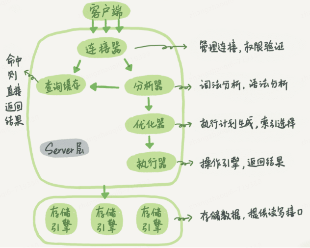

# 一条sql查询语句的执行过程

如图  

拿一条查询语句举例查询过程：  
select * from user where id = 3;

1. **连接器**：通过命令 mysql -h$ip -P$port -u$user -p 连接mysql，此时使用到的就是连接器
2. **查询缓存**：查询mysql是否缓存了这个sql语句，如果有直接返回查询结果，没有在进行下述步骤。（缓存可以理解为k是查询语句，v是查询结果）当一个表上有更新的时候，跟这个表有关的查询缓存都会失效，一般不建议使用缓存，mysql8已经移除了缓存
3. **分析器**：分析器进行词法分析和语法分析。词法分析就是把上述mysql查询语句中的空格、关键字等做分析取出来；语法分析就是分析具体的查询语句是否具有语法错误
4. **优化器**：mysql会优化sql，得出一个最佳的查询方案，然后去准备执行
5. **执行器**：mysql通过分析器知道了要做什么，通过优化器知道了应该怎么做，之后就到了执行器，开始执行语句从存储引擎查询数据。执行的时候还会判断当前用户是否有该表的查询权限