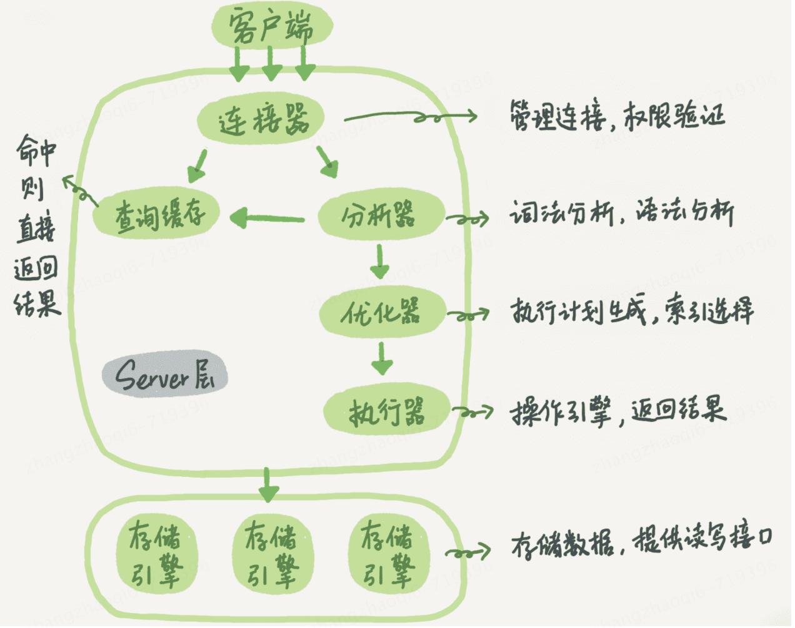
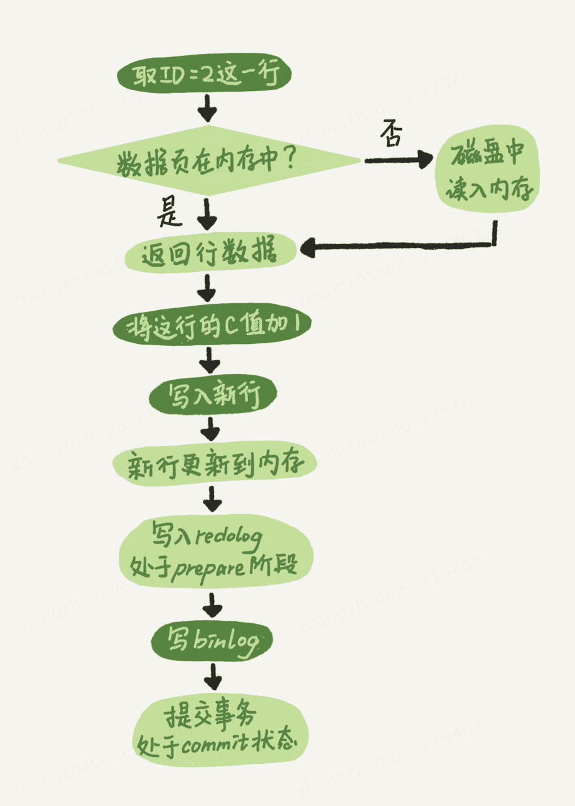

# 一条sql更新语句的执行过程

以 update user set name = 'zhangzi' where id = id+1;为例说明  
和查询语句类似。更新语句也是先连接数据库，这是连接器的工作。接下来，分析器会通过词法分析和语法分析知道这是一条更新语句。优化器决定使用id这个索引列查询。然后，执行器负责调用存储引擎进行具体查询找到目标行然后更新   
**与查询流程不同的是，更新流程还涉及两个重要的日志模块，redo log（重做日志）和binlog（归档日志）。**
# log系统
如果每一次的更新操作都需要写进磁盘就需要每一次都去磁盘中查找数据，找到数据所在位置进行更新，整个IO成本，查找成本都很高，为了解决这个问题，mysql加入了log系统，而log系统和磁盘的配合写入就是经常说到的WAL技术（Write-Ahead Logging）  
他的关键点在于先写日志，再写磁盘。
## redo log（重做日志）  
redo log的文件大小是有限制的，比如配置一组4个文件，每个文件1GB，具体操作的时候会从头开始写，写到末尾就又回到开头循环写。如下所示：    
  
write pos是当前记录的位置，一边写一边后移，写到第3号文件末尾后就回到0号文件开头  
checkpoint 是当前要擦除的位置，也是往后推移并且循环的，擦除记录前要把记录更新到数据文件  
write pos和checkpoint之间是还可以用来记录新的数据的位置。如果write pos赶上了checkpoint表示redo log已满，需要先擦除掉一些记录。  

有了redo log，innodb就可以保证即使数据库发生异常重启，之前提交的记录都不会丢失，这个能力称为crash-safe，比如突然宕机，也是可以从redo log和磁盘中找到数据的    
## binlog（归档文档）  
binlog是mysql Server层的日志，redo log是引擎层的日志，且是innodb特有的。binlog只是用来做归档，没有crash-safe能力。  
## 日志区别
binlog和redo log的区别  
1. redo log是innodb引擎特有的日志；binlog是mysql的server层实现的，所有引擎都可以使用  
2. redo log是物理日志，记录的是“在某个数据页上做了什么修改”；binlog是逻辑日志，记录的是这个语句的原始逻辑，比如“给id=2这行的c字段加1”  
3. redo log是循环写的，空间固定会用完；binlog是可以追加写的。

# 结合两种日志总结执行器和innodb引擎在执行update语句时的流程  
以 update user set name = 'zhangzi' where id = 2;为例  
执行器先找到id=2这一行。id是主键，引擎直接采用树形搜索。如果id=2这一行在内存中，就直接返回给执行器；否则，需要先从磁盘读入内存，然后在返回。  
执行器拿到引擎给的数据，把这个值+1，在调用引擎接口把这行新的数据写入。  
引擎将这行新数据更新到内存中，同时将这个更新操作记录到redo log里面，此时redo log处于 prepare状态。然后告诉执行器完成了，随时可以提交事务。执行器生成这个操作的binlog，并把binlog写入磁盘。  
执行器调用引擎的提交事务接口，引擎把刚刚写入的redo log改成提交（commit）状态，更新完成   
上述过程总结为图如下，浅色框为InnoDB内部执行的，深色框表示是在执行器中执行的：     
  
# 两阶段提交  
上述提到了执行器和innodb引擎交互完成一次update操作时的步骤，最后在redo log和binlog之间来回进行了两次提交，专业的术语叫做两阶段提交，为什么要进行两阶段提交呢 ？  
仍然使用前面的例子，假设id=2的行，字段c的值是0，在假设在第一个日志写完之后，第二个日志还没写完期间发生了crash。使用反证法来论证，如果不使用两阶段提交那么就是要么先提交redo log，要么先提交binlog    
**先提交redo log再提交binlog**  
此时redo log写完，binlog还没有写完，mysql进程异常。前面说过，崩溃恢复后，根据redo log恢复完的数据 c=1。   
但是由于binlog没有写完就crash了，这时候binlog里面就没有记录这个语句，因此，之后备份日志时，存起来的binlog里面就没有这条语句。  
当使用这份binlog进行临时库的恢复或者扩容实例，就会造成与原库数据不一致的情况   
**先提交binlog再提交redo log**
如果在binlog写完之后crash，此时redo log还没有写入，崩溃恢复后这个事务无效，所以这一行c的值是0。但是binlog里面已经记录了“把c从0改为1”这个日志。所以，在之后用binlog来恢复的时候就多了一个事务出来，
恢复出来的数据这一行的c就是1，与原库的值不一致  
# 思考
1. redo log主要是为了提高数据的性能，不需要每次写操作都直接查找磁盘中被修改数据的位置然后更新，而是直接写入redo log，让任务线程自己去redo log读取操作然后更新磁盘，大大提升了mysql的效率  
2. binlog记录的是原始的sql语句，主要是为了备份数据库数据，在数据库扩容、崩溃恢复等多种场景中可以即使的恢复出某个时间点的完整数据
3. redo log记录的是物理日志，包括修改的数据的位置（在哪一页），偏移量是多少，更改的数据内容是什么