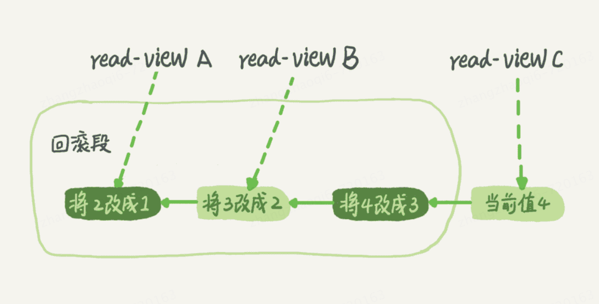

# 事务的四个特性
ACID，Atomicity（原子性），Consistency（一致性），Isolation（隔离性），Durability（持久性）
# 细说隔离性
当数据库有多个事务同时执行的时候，就可能出现脏读，不可重复读，幻读的问题，为了解决这些问题就有了“隔离级别的概念”。  
mysql的事务隔离级别如下：  
* 读未提交：一个事务还没有提交时，他做的变更就可以被其他事务看到
* 读已提交：一个事务只有提交过后，他所做的变更其他事务才能够看到
* 可重复读：一个事务执行过程中看到的数据，总是跟这个事务在启动时看到的事务一致
* 串行化：顾名思义是对同一条记录，读需要加读锁，写需要加写锁，当出现读写锁冲突的时候，后访问的事务需要等前一个事务执行完成后再继续执行
# 事务隔离的实现
在mysql中，实际上每条记录在更新的时候都会同时记录一条回滚操作。记录上的最新值，通过回滚操作，都可以得到前一个状态的值   
假设一个值从1被按顺序修改成了2，3，4，在回滚日志中就会有类似下面的记录

当前值是4，但是在查询这个记录的时候，不同时刻启动的事务会有不同的 read-view。如图中看到的，在视图A、B、C中，这一个记录的值分别是1，2，4，同一条记录在系统中可以存在
多个版本，就是数据库的多版本并发控制（MVCC）。对于read-view A，要得到1，就必须将当前值依次执行图中所有的回滚操作得到。    
同时，即使现在有另外一个事务正在将4改成5，这个事务跟 read-view A、B、C对应的事务是不会冲突的。   
## 回滚日志的保留  
回滚日志的删除时机：系统会判断，当没有事务在需要用到这个回滚日志的时候，回滚日志就会被清除。判断没有事务在使用回滚日志的标准就是当前系统里没有比这个回滚日志更早的read-view。   
# 为什么不建议使用长事务
长事务意味着系统里会存在很老的事务视图。由于这些事务随时可能访问数据库中的任何数据，所以这个事务提交之前，数据库里面他可能用到的回滚记录都需要保存，这就会导致占用大量空间   
在mysql5.5及以前的版本，回滚日志是跟数据字典一起放在ibdata文件里的，即使长事务最终提交，回滚段被清理，文件也不会变小。可能数据只有20GB，而回滚段有200GB的库，最终为了清理回滚段只能重建库   
除了对回滚段的影响，长事务还占用锁资源，也可能拖垮整个库。   

