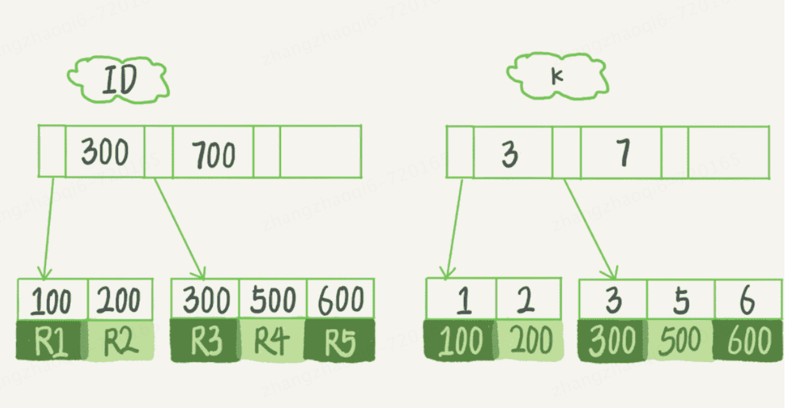

# InnoDB的索引模型 
在innodb中，表都是根据主键顺序以索引的形式存放的，这种存储方式的表称为索引组织表。**每一个索引在InnoDB里面对应一棵B+树**。     
假设，我们有一个主键列为ID的表，表中有字段k，并且k上有索引。这个表的建表语句如下：      
```text
mysql> create table T(
id int primary key, 
k int not null, 
name varchar(16),
index (k))engine=InnoDB;
```
表中 R1~R5 的 (ID,k) 值分别为 (100,1)、(200,2)、(300,3)、(500,5) 和 (600,6)，两棵树的示例示意图如下。   

从图中可以看到，根据叶子节点的内容，索引类型分为**主键索引**和**非主键索引**。主键索引也被称为**聚簇索引**，存储的是整行的数据；非主键索引存储的是主键的值，在InnoDB中也被称为**二级索引**。
**基于主键索引和普通索引的查询有什么区别？**   
如果语句是select * from T where ID=500，即主键查询，则需要搜索ID这棵B+树；   
如果语句是select * from T where k=5，即普通索引查询，则需要先搜索k索引树，得到ID的值为500，再到ID索引树搜索一次。这个过程称为**回表**   
## 选用B+树的原因
B+树能够很好的配合磁盘的读写特性，减少单次查询的磁盘访问次数   
# 索引维护 
B+树为了维护索引有序性，在插入新值的时候需要做必要的维护。以上图为例，插入新的行ID值为700，则只需要在R5的记录后面插入一个新记录。    
如果新插入的ID值为400，就相对麻烦了，需要逻辑上挪动后面的数据，空出位置  
此时如果R5所在的数据页已经满了，根据B+树的算法，此时需要申请一个新页出来，然后挪动部分数据过去。这个过程称为**页分裂**，这种情况下性能自然会受到影响。除了性能外，页分裂操作还影响数据页的利用率。
原本放在一个页的数据，现在放在两个页中，可能每个页的利用率就降低了50%      
有页分裂就有页合并，当相邻两个页由于删除了数据，利用率很低之后，会将数据页做合并。合并的过程，可以认为是分裂过程的逆过程    
# 是否需要自增主键？
1. 从页分裂的角度来说，每个表都需要有自增主键。因为自增主键符合递增插入，新的数据总是在树的最后插入，避免了页分裂的发生，也不涉及数据挪动的情况。
而有业务逻辑的主键，往往不容易保证有序插入，这样写数据成本相对就高了，比较容易造成数据挪动和页分裂问题   
2. 除了考虑性能外，还可以从存储角度来考虑。假设表中确实有一个唯一字段，比如字符串类型的身份证号做主键，那么每个二级索引的叶子节点则要占用20个字节，而如果用整型做主键，则只要4个字节，如果是长整型
（bigint）也就是8个字节。显然，主键长度越小，普通索引的叶子节点就越小，普通索引占用的空间也就越小     
综上，从性能和存储空间两个方面考量，自增主键往往是更合理的选择   
