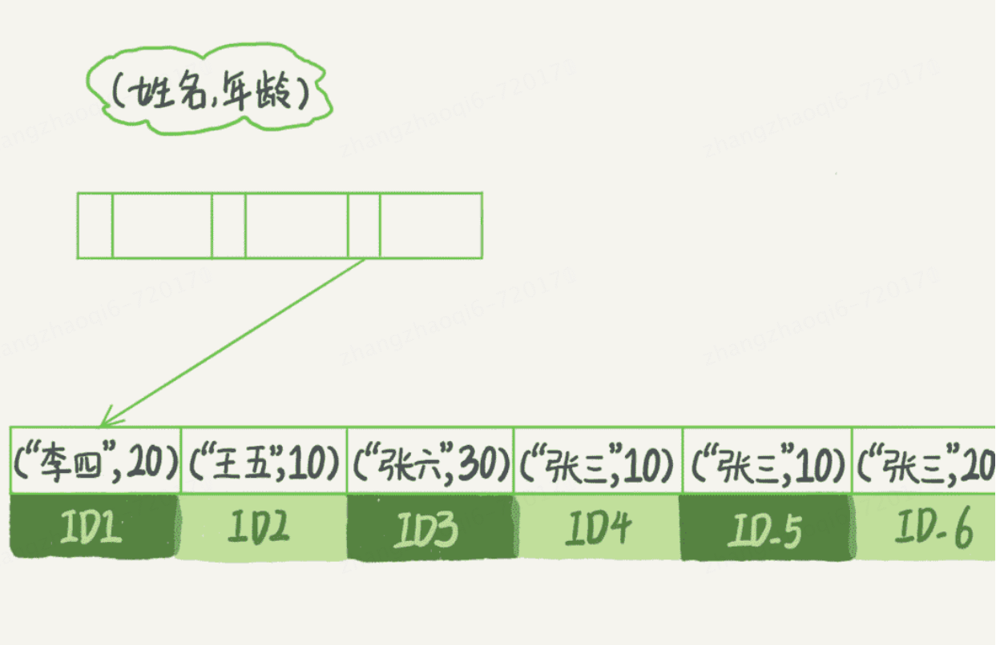
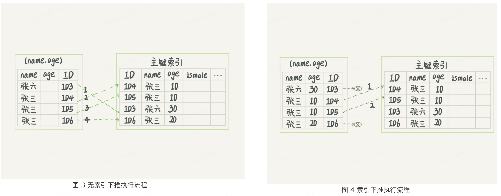

# 覆盖索引
在下面这个表中查询  select ID from T where k = 3;
```text
mysql> create table T (
ID int primary key,
k int NOT NULL DEFAULT 0, 
s varchar(16) NOT NULL DEFAULT '',
index k(k))
engine=InnoDB;
 
insert into T values(100,1, 'aa'),(200,2,'bb'),(300,3,'cc'),(500,5,'ee'),(600,6,'ff'),(700,7,'gg');
```
整个查询过程如下：会先根据k索引找到k=3的叶子节点拿到ID=300，然后去主键索引表中根据主键索引找到数据，查询过程中发生了**回表**   
其实如果ID值已经在K索引中，那么就可以直接提供查询结果，不需要回表。也就是说，在这个查询中，索引k已经覆盖了我们的查询需求，这个就叫做**覆盖索引**  
**由于覆盖索引可以减少树的搜索次数，显著提升查询性能，所以使用覆盖索引是一个常用的性能优化手段**   
**使用覆盖索引的通常手段是给多个字段建立联合索引**   
# 最左前缀原则
B+树这种索引结构，只要满足最左前缀，就可以利用索引来加速检索。这个最左前缀可以是联合索引的最左N个字段，也可以是字符串中索引的最左M个字符。   
举例：   
有一个（name,age）的联合索引，此时需求是查找名字是张三的人，此时就能够根据该索引找到ID4，然后向后遍历就可以找出所有的结果。   
如果要查的是所有名字第一个字是“张”的人，那么sql语句就会是 where name like '张%'，这时也是能够用到这个索引的，找到第一个符合条件的记录是ID3，然后向后遍历，直到不满足条件为止   

# 索引下推
举例sql：mysql> select * from tuser where name like '张%' and age=10 and ismale = 1;    
当执行这个sql时会根据索引查找name是张开头的数据，然后判断其他条件是否满足  
1. 在mysql5.6之前，通过name找到ID3之后会开始一个一个回表。到主键索引上找出数据行，再对比字段值。  
2. mysql5.6引入索引下推优化，可以在索引遍历过程中，对索引中包含的字段先做判断，直接过滤掉不满足条件的记录，减少回表次数。
如下图：  

在图三中，（name，age）中特意去掉了年龄的值，这个过程innodb并不会去看age的值，只是按顺序把“name第一个字是张的记录一条条取出来回表然后比较是否符合查询条件”，因此需要回表四次   
在图四中，innodb在（name，age）索引内部就判断了age是否等于目标值，如果不等于目标值就直接跳过了，所以最终只需要回表两次   

