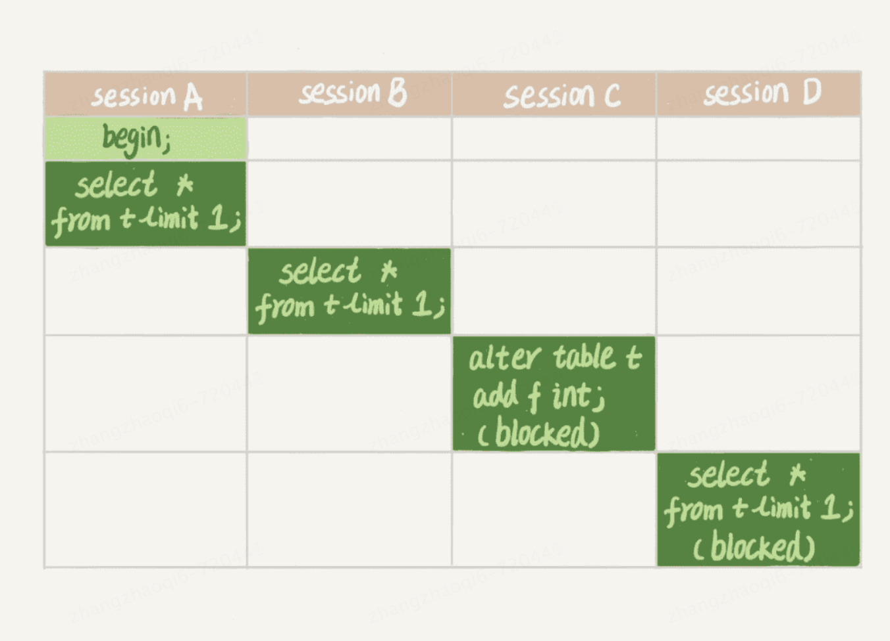

# 全局锁
全局锁就是对整个数据库加锁，整个数据库处于只读状态。之后其他线程的以下语句都会被阻塞：数据更新语句（数据的增删改）、数据定义语句（包括建表、修改表结构等）和更新类事务的提交语句  
全局锁的使用场景是做某一时刻的全库备份逻辑  
# 表锁 
MYSQL里面表级别的锁有两种：一种是表锁一种是元数据锁（meta data lock，MDL）。   
## 表锁
表锁的语法是 lock tables ...read/write。可以用unlock主动释放锁，也可以在客户端断开的时候自动释放锁。需要注意的是lock tables语法除了会限制别的线程的读写外，也限定了本线程接下来的操作对象。    
举例：某个线程A中执行了lock tables t1 read，t2 write；这个语句，则其他线程写t1，读写t2的语句都会阻塞。同时线程A在执行unlock tables之前，也只能执行读t1，读写t2的操作。连写t1都不允许，自然也不能访问其他表   
innodb中支持行锁，表锁的开销非常大，所以一般都不使用    
## 元数据锁 
元数据锁简称MDL锁（metadata lock）。MDL锁不需要显式指定，在访问一个表的时候会自动加上。MDL的作用是保证读写的正确性，比如在一个查询的过程不能够进行表列的增加或者删除，否则读出来的数据就不对了。  
因此，在mysql5.5版本中引入了MDL，当对一个表进行增删改查的时候会加MDL读锁，当对一个表结构进行变更的时候会加MDL写锁。读锁之间不互斥，读写锁、写锁之间互斥，用来保证变更表结构的安全性。因此，如果
有两个线程要同时要给一个表加字段，其中一个要等待另一个执行完成之后才能执行。  
### 元数据锁可能会导致的风险  
由于MDL锁的互斥性，不小心使用可能会造成整个库崩溃，如下图：   
  
1. sessionA开启事务获取MDL读锁
2. sessionB开启事务由于读锁不互斥也获取了MDL读锁
3. sessionC开启事务想要获取MDL写锁，此时A、B事务都没有释放读写，所以C事务阻塞
4. sessionD事务请求获取读锁，由于C事务阻塞住了，导致D事务也阻塞  
最终结果：整个过程导致表完全被锁住，表现为不可进行任何读写操作。如果长事务没有超时机制这些事务就会堆积占用大量的数据库资源，假如请求频繁还会有新的session被创建，那么数据库很快就会被打爆。   
# 事故的避免  
从上述内容需要知道**事务中的MDL锁，在语句执行开始时申请，但是语句结束后并不会马上释放，而会等到整个事务提交后在释放** ，所以如何给一个表安全的加字段？   
1. 首先解决长事务的问题，添加事务超时机制，事务执行事件过程自动kill，在修改表结构之前我们也可以手动查询是否存在长事务，如果存在则kill
2. 如果请求比较多，一个事务刚释放MDL锁另一个事务又获取了MDL，这种情况我们应该添加获取锁失败重试机制，线程获取MDL锁失败后放弃阻塞，一定时候后在重新尝试获取锁
