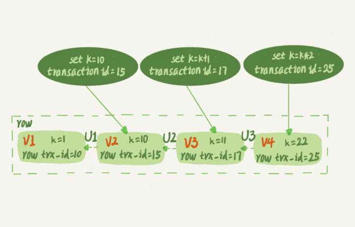

# 前言概览

行锁是在引擎层由各个引擎自己实现的。但并不是所有引擎都支持行锁，比如myisam引擎就不支持行锁，不支持行锁就只能使用表锁，表锁的粒度很大，当一个事务锁表之后其他事务就只能排队等待，这意味着业务的并发度就会很低
这也是myisam被innodb逐渐代替的原因   
顾名思义，行锁就是针对一行数据的锁，比如事务A更新了一行，而是这时候事务B也要更新同一行，则必须等待事务A的操作完成后才能进行更新。    
当然，数据库中还有一些没那么一目了然的概念和设计，这些概念如果使用不当或理解不当就会造成问题，导致程序出现非预期情况，比如两阶段锁。

# 两阶段锁

有如下事务如图：   

**在InnoDB事务中，行锁是在需要的时候才加上的，但并不是不需要了就立刻释放，而是要等到事务结束时才释放，这个就是两阶段锁协议**

对应到图中过程就是，A事务在对id=1行上锁之后并不会在update t set k=k+1 where
id=1；执行之后释放锁，而是等到整个事务结束才会释放id=1的行锁，所以事务B会一直阻塞到事务A结束

# 提高行锁性能实践   
知道了上述两阶段锁的设定，我们应该知道，在一个事务中应该把最容易发生锁冲突、最可能影响并发度的锁尽量往后放，举例：    
假设有一个电影票在线交易系统，顾客A要在系统B购买电影票。简化过程如下：   
1. 从顾客A账户余额中扣除电影票价
2. 给影院B的账户余额增加这张电影票价
3. 记录此次交易记录  

也就是说完成此次交易需要update两次，insert一次，那么如果三个操作在一个事务中执行，应该如何安排语句的执行顺序？   
答案是，1，3，2 。 因为如果有多个用户同时购票，那么影院B账户余额这一行就是一个热点行，所有的事务都需要去操作这一行数据。根据两阶段协议，不论怎么安排这些语句的顺序，行锁的释放都是在事务结束的时候，
所以，如果把语句2安排在最后，那么这一行的锁时间就最少，这就最大程度的减少了事务间锁等待的时间，提高了并发度。
# 死锁的必要条件  
1. 互斥：资源同时只能被一个线程占有，其他线程互斥
2. 不可抢占：线程获取资源后，在未使用完时不能够被其他线程抢占
3. 占有且等待：占有资源的同时申请别的资源被阻塞的同时不释放当前资源
4. 循化等待：多个线程互相请求对方持有的资源   
# 死锁/锁等待导致的cpu爆满
如果这个影院做活动，可以低价预售一年内所有的电影票，而且这个活动只做一天。于是在活动时间开始的时候，你的 MySQL 就挂了。你登上服务器一看，CPU 消耗接近 100%，但整个数据库每秒就执行不到 100 个事务。这是什么原因呢？

如上两个事务，事务A在等待事务B释放id=2的行锁，事务B在等待事务A释放id=1的行锁。事务A和事务B在相互等待对方释放锁，就是进入了死锁的状态。
## 解除死锁的策略
1. 直接进入等待，直到超时。通过参数innodb_lock_wait_timeout（默认值是50）来设置。比如事务A想要获取id=2的行锁，超过50s后自动放弃。但是对于一个在线服务来说，这个时间是不可接受的。如果把时间设置为1s，那么又可能提前
结束了一些还没有运行结束本不该被强制关闭的事务
2. 死锁检测机制：通过参数innodb_deadlock_detect控制，默认就是打开，在发生死锁的时候，是能够快速发现并进行处理的，但是存在额外负担，设想每当一个事务被锁的时候，就要看看他所依赖的线程有没有别别人锁住，如此循环，最后
判断是否出现了循环等待，也就是死锁。当并发特别大的时候，死锁检测机制就要耗费很多的cpu使用率，最终出现cpu使用率爆满但是事务缺没有完成几条的情况  
# 如何解决热点行数据更新导致的性能问题  
1. 如果能够确保业务一定不会发生死锁，就把死锁检测之间关闭掉
2. 控制并发度
3. 可以将热点行拆成多行，比如金额行从一行变成10行，这样热点请求也可以分为十分之一去请求不同的行，但是这种方法业务其他地方也需要跟着修改下

