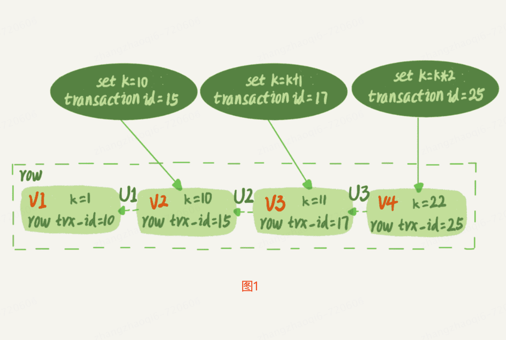
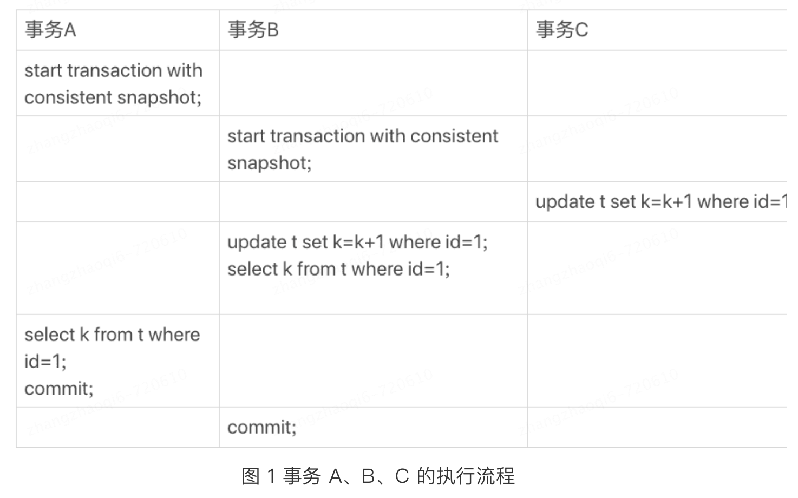

# 可重复读隔离级别下的事务隔离是如何实现的？

实现方案：**快照读+MVCC+consistent read-view**
当一个事务开启时候会创建一个快照（注意这个快照是基于整库的），此次事务中的所有数据变更都是基于这次快照中的内容，不同事务之间互不影响从而达到隔离性的效果。这时，可能会有人说这看上去不太实现，如果库有100G，那么启动一个事务，mysql要拷贝100G的数据出来吗，这得要多慢，平时事务
执行可是非常快的。实际上，确实不需要拷贝这100G的数据，那么快照读是如何实现的呢？   
# mysql快照读的实现
## 事务id：row trx_id
数据库表中每一行数据都可能是会有**多个版本**的（因为某一行的数据因为update等业务的方法都是会变化的，每变化一次就会多一个版本），这个版本叫做**数据版本**，每个数据版本中都会记录此次更新操作的事务的id，记为 row trx_id（也有表述为行隐藏列的）
```qute
事务id: 在一个事务开始执行的时候，会去数据库事务系统中申请一个事务id，叫做transaction id，这个id是按申请顺序严格递增的。
```
比如下图，一条记录被多个事务连续更新后的状态:  

k=1被不同事务连续修改为10、11、22，此时产生了三个新的版本，并且每个版本都记录此次修改的row trx_id。
## undo log(回滚日志)
图一中的v1，v2，v3，v4并不是物理上真实存在的，一个行的数据版本只是一个虚拟概念。数据版本需要通过undo log配合当前版本来计算出来。比如需要v2的时候，就是通过v4依次执行U3、U2算出来。而U3、U2实际上就是**undo log**，又被称为回滚日志    
## 简易的理解快照读的实现
明白了数据的多版本，事务的id，接下来再来看看如何定义事务开始时的那个“100G”的快照。  
按照可重复读的定义，一个事务启动的时候，能够看到所有已经提交的事务结果。但是之后，这个事务执行期间，其他事务的更新就对他不可见了。因此，一个事务只需要在启动的时候声明说，“以我启动的时刻为准，如果一个数据版本是在我启动之前生成的，就认；如果是我启动之后才生成的，我就不认，我必须要
找到他的上一个版本”。当然如果上一个版本也不可见，那就得继续往前找。   
在实现上，InnoDB为每个事务构造了一个数组，用来保存这个事务启动瞬间，当前正在“活跃”的所有事务ID，这个数组称为 **视图数组**。“活跃”指的就是事务启动了但是没有提交。在这个数组中事务ID最小值记为低水位，事务ID最大值+1记为高水位。这个视图数组和高水位，就组成了当前事务的 **一致性视图（read-view）**。
而 **数据版本的可见性就是基于一致性视图的比对结果得到的**。
## 一致性视图（read-view）
视图数组把所有的 row trx_id 分成了几种不同的情况，如下图所示：   
   
这样对于当前事务的启动瞬间来说，一个数据版本的 row trx_id，有以下几种可能：   
如果落在绿色部分，表示这个版本是已提交的事务或者是当前事务自己生成的，这个数据是可见的；   
如果落在红色部分，说明这个版本是由将来启动的事务生成的（即在开启这次事务的时候该事务还没有创建出来，不再运行中），这个数据肯定是不可见的；   
如果落在黄色部分，表示这个版本是由还没提交的事务生成的，不可见。      
比如对于图1，如果有一个事务，他的低水位是18，那么当他访问这一行数据时，就会从v4通过U3计算出v3，所以在他看来，这一行的值是11。有了这个声明，系统里面随后发生的更新，就跟这个事务看到的内容无关了，因为之后的更新，生成的版本一定属于上面的2或者3，而对他来说，这些新的数据版本是
不存在的，所以这个事务的快照就是“静态”的了。   
所以现在应该知道了，**InnoDB利用了“所有数据都有多个版本”的这个特性，配合一致性视图来决定当前事务能看到哪些版本的数据从而实现了“秒级创建快照”并能够支持快照读的能力**，这也就是多版本并发控制MVCC。
# 总结MVCC和read-view配合实现事务隔离   
1. 每行数据具有多个版本，每个版本中会记录该版本对应的事务id
2. 当一个事务开启后，在读取数据的时候会按照read-view（一致性视图）中记录的事务信息来决定读取当前这条数据的哪个版本，具体判断读取哪个版本的规则就是上述讲到的“水位判断”   
# 实践举例
表初始化语句如下：
```text
mysql> CREATE TABLE `t` (
  `id` int(11) NOT NULL,
  `k` int(11) DEFAULT NULL,
  PRIMARY KEY (`id`)
) ENGINE=InnoDB;
insert into t(id, k) values(1,1),(2,2);
```

## 查询逻辑
为什么上图中的事务A返回的结果是1   
假设前提：事务A开始前，系统里面只有一个活跃事务ID是99；事务A、B、C的版本号分别是100、101、102，且当前系统里只有这四个事务；三个事务开始前，(1,1)这行数据的 row trx_id是90   
基于上述：事务A的视图数组就是[99,100],事务B的视图数组是[99,100,101],事务C的视图数组是[99,100,101,102]。   
跟事务A查询逻辑有关的操作如下：   

从图中可以看到，第一个有效更新是事务C，把数据从(1,1)改成了(1,2)。这时候，这个数据的最新版本的row trx_id 是102，而90这个版本已经成为了历史版本   
第二个有效更新是事务B，把数据从(1,2)改成了(1,3)。这时候，这个数据的最新版本的row trx_id是101，而102又成为了历史版本。   
在事务A查询的时候，事务B还没有提交，他生成的(1,3)版本为当前版本，但是这个版本对A是不可见的，他的视图数组是[99,100],所以事务A查询语句的读数据流程如下：   
1. 从当前版本读起，找到(1,3)，此时发现row trx_id=101，比高水位高，处于红色区域，不可见
2. 接着，找到上一个版本(1,2)，此时row trx_id=102，比高水位高，处于红色区域，不可见
3. 在接着找上一个版本(1,1)，此时发现row trx_id=90，比低水位还低，处于绿色区域，可见    

这样执行下来，虽然期间这一行数据被修改过，但是事务A不论在什么时候查询，看到这行数据的结果都是一致的，所以我们称之为一致性读。       
上述过程也可以简化总结为如下：   
一个数据版本，对于一个事务视图来说，除了自己的更新总是可见之外，有三种情况   
* 版本未提交，不可见
* 版本已提交，但是是在视图创建之后提交的，不可见
* 版本已提交，而且是在视图创建之前提交的，可见  
## 更新逻辑  
**为什么上图中事务B的返回结果是3，而不是1，按照一致性读，结果是不是不对？** 按照下方图5的逻辑，事务B的视图数组是先生成的，之后事务C才提交，不是应该看不见(1,2)吗，怎么能算出来(1,3)?     
 

是的，如果事务B在更新之前查询一次数据，这个查询返回的k的值确实是1。    
但是，当他要去更新数据的时候，就不能在历史版本上更新了，否则事务C的更新就丢失了。因此，事务B此时的set k=k+1是在(1,2)的基础上进行的操作    
所以，这里就用到了一个规则： **更新数据都是先读后写的，而这个读，只能读当前的值，称为“当前读”**    
因此，在更新的时候，当前读拿到的数据是(1,2)，更新后生成了新版本的数据(1,3)，这个新版本的row trx_id是101。   
所以，在执行事务B的查询语句的时候，一看自己的版本号是101，最新数据的版本号也是101，是自己的更新，可以直接使用，所以查询得到的k的值是3。    
除了update语句外，select语句如果加锁，也是当前读。所以如果把事务A的查询语句加上lock in share mode 或 for update，也都可以读到版本号是101的数据，返回的k的值也是3    
### 新的假设
假设事务C不是立马提交的，而是变成了下方的事务C'，会怎样？   

事务C'的不同在于更新后并没有立马提交，在他提交前事务B又发起了更新语句，虽然事务C'还没有提交，但是(1,2)这个版本已经生成了，并且是当前的最新版本。那么此时事务B会怎样呢？    
**这时候“两阶段锁协议”就要上场了**。事务C'没提交，也就是说(1,2)这个版本上的写锁还没释放。而事务B是当前读，必须要读最新版本，而且必须加锁，因此就被锁住了，必须等到事务C'释放这个锁，才能继续他的当前读     
至此，一致性读、当前读和行锁就串起来了    
```qute
一致性读：在一个事务中读取一个数据，值总是一致的，不管这个期间发生了什么事情或者别的事务怎么操作这个数据了都不会影响一致性读
```
# 总结：事务的可重复读能力是怎么实现的？   
可重复读的核心就是一致性读(consistent read)；而事务更新数据的时候，只能用当前读。如果当前的行记录的行锁被其他事务占用的话，就需要进入锁等待。**普通查询语句是一致性读，一致性读会根据 row trx_id 和一致性视图确定数据版本的可见性。**    
      
而读提交的逻辑和可重复读相似，区别在于在可重复读隔离级别下，只需要在事务开始的时候创建一致性视图，之后事务里的其他查询都公用这个一致性视图；**在读提交隔离级别下，每一个语句执行钱都会重新算出一个新的视图**。   
所以如果是读提交的隔离级别，事务A读出来的结果应该是2，事务B读出来的结果应该是3     

对于可重复读，查询只承认在事务启动前就已经提交完成的数据；   
对于读提交，查询只承认在语句启动前就已经提交完成的数据；    
而当前读，总是读取已经提交完成的最新版本。    


 


 


