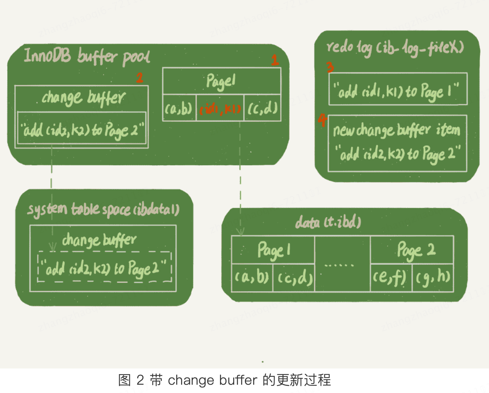
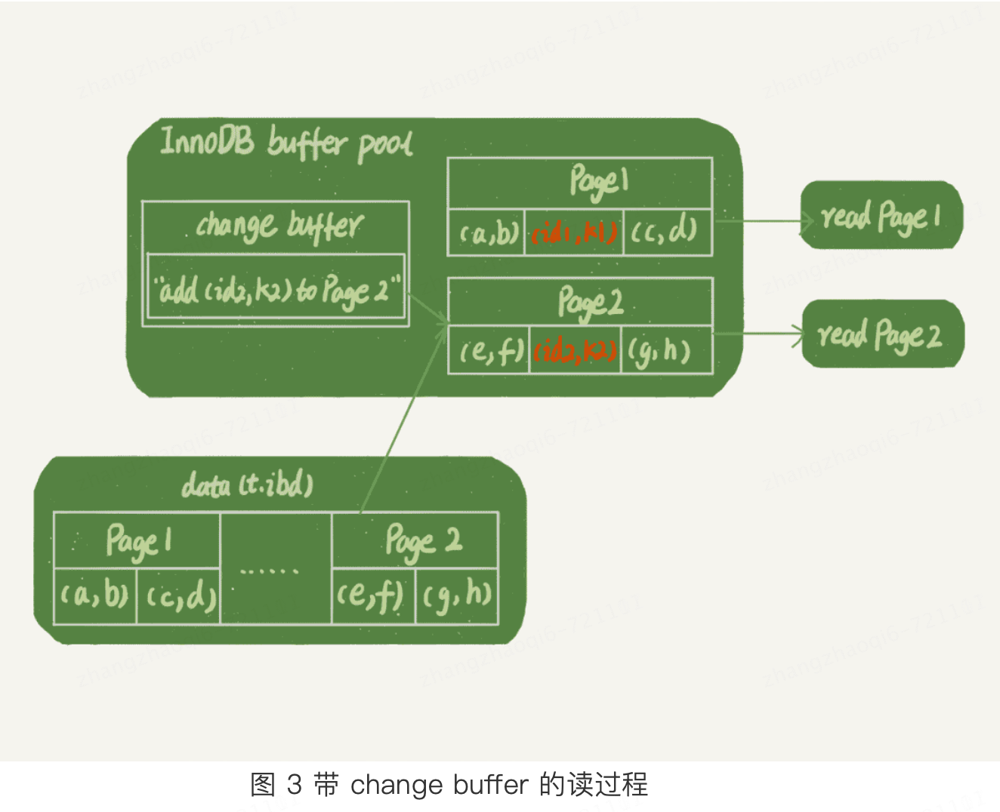

# 认识change buffer
当 **更新一个数据页** 的时候，如果数据页在内存中，会直接更新内存中的这个数据页，如果数据页不在内存中，在不影响数据一致性的前提下，InnoDB会将这些更新操作缓存在change buffer中，这样就不需要去磁盘中读取这个数据页
了。在下次查询需要访问这个页的时候在将页从磁盘中读入内存，然后执行change buffer 中与这个页有关的操作。通过这种方式就能保证这个数据逻辑的正确性。整个更新过程先记录在change buffer，减少读磁盘，语句的执行
速度会得到明显的提升。而且，数据读入内存是需要占用buffer pool的，所以这种方式还能够避免占用内存，提高内存利用率。     

change buffer是可以持久化的数据，在内存中有拷贝，也会被写入到磁盘上  

将change buffer中的数据应用到原数据页，得到新的结果的过程称为merge。除了访问这个页会触发merge外，系统有后台线程也会定期进行merge。在数据库正常关闭（shutdown）的过程中，也会执行merge操作   
## 什么时候可以使用change buffer
对于唯一索引来说，插入一个数据的时候需要进行唯一性的校验，这个校验过程需要将页读入存在进行判断，而数据都已经在内存中了，数据更新也就没必要更新到change buffer中了，直接更新内存就好了，因此，唯一索引的更新
就不能使用change buffer了。    

**实际上也只有普通索引可以使用change buffer**。   
change buffer使用的是buffer pool里面的内存，因此不能无限增大。change buffer的大小，可以通过参数 innodb_change_buffer_max_size来动态设置。这个参数设置为50的时候，表示change buffer的大小最多
占用buffer pool的50%   

## InnoDB使用change buffer的过程   
比如要在一个表中插入一个新纪录(4,400)，InnoDB的处理流程如下：    
**情况一**：这个记录要更新的目标页在内存中。
* 对于唯一索引来说：判断3和5之间的位置，判断到没有冲突，插入这个值，语句执行结束
* 对于普通索引来说，找到3和5之间的位置，插入这个值，语句执行结束
这种情况下普通索引和唯一索引对更新语句性能影响的差别，只是一个判断，只会耗费微小的CPU时间
**情况二**：这个记录要更新的目标页不再内存中
* 对于唯一索引来说：加载数据页到内存中，判断3和5之间是否存在插入冲突，如果没有则插入，语句执行结束
* 对于普通索引来说：将记录更新到change buffer，语句执行就结束了    
将数据从磁盘读到内存中涉及随机IO的访问，是数据库里面成本最高的操作之一。change buffer因为减少了随机磁盘访问，所以对更新性能的提升是会很明显的。   
随机磁盘访问：当更新一个数据的时候，这个数据可能在磁盘的任何位置，此时磁头就需要在磁盘上不断的来回寻址找到数据所在的页    

## 使用change buffer的最佳场景
通过上述介绍，了解到了change buffer只适用与普通索引的场景，那么只要是普通索引就适合使用change buffer吗？    
因为merge的时候是真正进行数据更新的时刻，而change buffer的主要目的就是将记录的变更缓存下来，所以在一个数据页做merge之前，change buffer中记录的数据变更越多，收益就越大    
因此，对于写多读少的系统，比如日志系统、账单系统等就非常适合使用change buffer。对于读多写少或者刚刚插入就需要读取结果的业务场景就不适合了，读取的时候就要进行随机IO读取页到磁盘中，这样反而
增加了change buffer 维护的代价。   
# 查询和更新过程中应该如何选择索引  
## 查询过程   
普通索引：根据一个索引查询数据时，会在普通索引的B+输上根据索引找到目标值之后会顺着叶子节点继续顺序往下找，直到碰到一个不符合查询条件的值之后返回    
唯一索引：根据一个索引查询数据时，会在唯一索引的B+输上根据索引找到目标值之后直接返回   
差别：只是普通索引多了顺序查找不符合查询条件的结果这一步，而B+树的叶子结点本就是一个双向列表，也就只是一次指针寻址和计算的过程，本质上查询操作使用普通索引和唯一索引没多大区别，CPU计算差距可以忽略不计    
## 更新过程   
更新操作由于存在 change buffer，所以需要根据具体的业务场景判断使用哪种索引，如果是读多写少的系统建议就使用普通索引，如果是写多读少则反之，但前提是使用某种索引不会影响到业务    
## 索引选择和实践  
综上，普通索引和唯一索引在查询能力上是没差别的，主要考虑的是对性能的影响。所以一般建议选择普通索引。如果所有的更新后面立即有查询操作，那么应该关闭change buffer功能，而且其他情况下，change buffer都是可以
提升性能的，对于数据量大的表，change buffer+普通索引优化效果还是比较明显的。特别的，如果是机械硬盘，change buffer这个机制的收益还是非常显著的。   
# change buffer 和 redo log
这是两个东西，以 mysql> insert into t(id,k) values(id1,k1),(id2,k2); 为例，假设k1所在的数据页在内存中，k2所在的数据页不在内存中。    
整个插入过程如下：   
Page1在内存中，直接更新内存；    
Page2不再内存中，则在内存的change buffer区域，记录下“我要往Page2插入一行”这个信息   
做完这些，事务就可以完成了，整个过程如下图2所示。所以，可以看到，一条更新语句的成本很低，就是写了两处内存，然后写了一处磁盘（两次操作合在一起写了一次磁盘），而且还是顺序写的。   
同时，图中的两个虚线箭头，是后台操作，不影响更新的响应实践。    

在这之后，读请求如何处理？   
比如，要进行 select * from t where k in (k1,k2);   
如果读语句发生在更新语句后不久，内存中的数据都还在，那么此时的这两个读操作就与系统表空间（ibadata1）和redo log（ib_log_fileX）无关了，如下图3。          

从图中可以看到：
读 Page 1 的时候，直接从内存返回。有几位同学在前面文章的评论中问到，WAL 之后如果读数据，是不是一定要读盘，是不是一定要从 redo log 里面把数据更新以后才可以返回？其实是不用的。你可以看一下图 3 的这个状态，虽然磁盘上还是之前的数据，但是这里直接从内存返回结果，结果是正确的。   
要读 Page 2 的时候，需要把 Page 2 从磁盘读入内存中，然后应用 change buffer 里面的操作日志，生成一个正确的版本并返回结果。   
可以看到，直到需要读 Page 2 的时候，这个数据页才会被读入内存。   
所以，如果要简单地对比这两个机制在提升更新性能上的收益的话，**redo log 主要节省的是随机写磁盘的 IO 消耗（转成顺序写），而 change buffer 主要节省的则是随机读磁盘的 IO 消耗。**    
# 写入change buffer过程中机器断电是否会丢失数据  
答案：不会丢失  
虽然写入change buffer是一个内存操作，但是在事务提交的时候，change buffer的操作也记录到了redo log里，所以崩溃恢复的时候，change buffer也可以找回来   
# merge 操作是否会把数据写入磁盘   
merge 的过程：   
从磁盘读入数据页到内存（老版本的数据页）    
从change buffer里找出这个数据页的change buffer记录（可能有多个），依次应用，得到新版数据页；    
写redo log，这个redo log里包含了数据的变更和change buffer的变更   
到这里merge 就结束了，这时候数据页和内存中change buffer对应的磁盘位置还都没有修改，属于脏页，之后各自刷回自己的物理数据，就是另一个过程了。   

