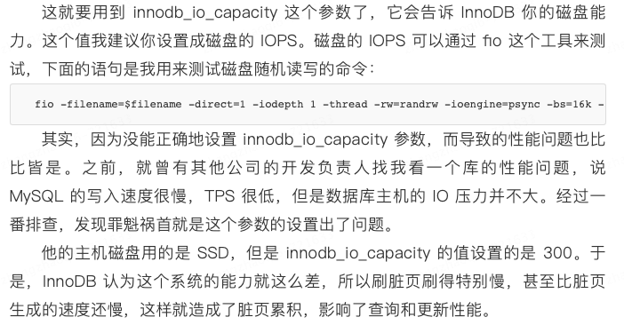

# 刷脏页引发的数据库抖动   
由于mysql的WAL(write ahead-logging)机制，更新类型的操作都会将更新记录写在redolog中，然后语句执行结果就返回了，然而redolog的大小是有限的，某些情况下就需要先把redolog中的内容
写到磁盘中之后，才可以继续执行后续的操作，比如某个查询操作或者更新操作触发了redo的刷盘，此时这个sql就会突然变的缓慢，此时从表像来看就是一个经常执行的sql突然执行变得缓慢了一下，但是
下次执行速度又恢复了，并且难以复现上一次的慢sql   
## 脏页   
redo log中没有刷入磁盘中的数据页称做脏页  
## 脏页的刷新时机   
1. redo log写满了，需要强制进行脏页的刷新 
2. 系统内存满了，此时需要加载新的数据页，不得不将一些老得脏页进行刷新  
3. mysql空闲的时候，自动刷新脏页
4. mysql正常关闭，内存中的脏页全部刷入内存
刷脏页虽然是一个常态化的操作，但是刷脏页还是会明显影响性能的，比如一次刷新太多脏页就会导致查询时间明显变长     
所以，mysql需要有控制脏页比例的机制    
## mysql刷新脏页需要关注的参数 
* 需要告诉innodb所在主机的io能力，这样innodb才能知道需要全力刷脏页的时候可以刷多快，相应参数：innodb_io_capacity  
   
* 脏页的比例控制参数：innodb_max_dirty_pages_pct，平时也需要关注脏页比例，不能接近 75%
* 脏页连坐机制：innodb_flush_neighbors，该参数可以配置刷新脏页的时候是否将该脏页内存连续的脏页同时刷掉，这个参数在HDD上十分实用   