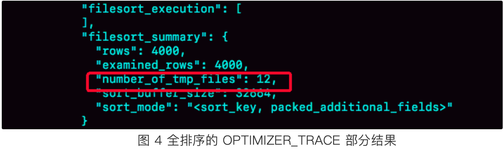
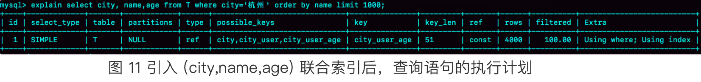

表定义:

```sql
CREATE TABLE `t`
(
    `id`   int(11) NOT NULL,
    `city` varchar(16) NOT NULL,
    `name` varchar(16) NOT NULL,
    `age`  int(11) NOT NULL,
    `addr` varchar(128) DEFAULT NULL,
    PRIMARY KEY (`id`),
    KEY    `city` (`city`)
) ENGINE=InnoDB;
```

查询语句:

```sql
select city, name, age from t where city = '杭州' order by name limit 1000;
```
上述sql是如何执行的？是怎样进行排序的？
# 全字段排序  
explain 命令查看sql执行过程显示如下：

可以看到Extra 中有 “Using fileSort”，表示这个查询语句需要进行排序。在线程执行这种查询的过程中，Mysql会给每个线程分配一块内存用来排序，这块内存称作 **sort_buffer**    
为了说明白整个排序过程，先看一下city这个索引的示意图，如下：    
  
可以看到，满足city = '杭州'的行，是从 ID_X 到 ID_(X+N)的这些记录。      
## 查询排序语句的执行过程如下   
1. 初始化sort_buffer，确定放入city、name、age三个字段
2. 从索引city找到第一个满足 city='杭州'条件的主键id，也就是图中的ID_X
3. 到主键id索引取出整行，取name、age、city三个字段的值，加入sort_buffer中
4. 从索引city中取下一个符合的值的主键id，并重复3、4步骤，直到city的值不满足查询条件为止，对应的主键id也就是图中的ID_Y
5. 对sort_buffer中的数据按照name字段做快速排序
6. 按照排序结果取前1000行返回给客户端   
### 排序详情
上述过程中，按照name排序的过程，可能在内存中进行，也可能要使用外部排序，这取决于排序要使用的**内存大小**和参数**sort_buffer_size**    
**sort_buffer_size**: mysql为排序开辟的内存(sort_buffer)的大小，如果要排序的数据量小于sort_buffer_size，那么整个排序过程就可以在内存中完成。但如果排序数据量过大，内存放不下，就不得不
利用磁盘临时文件辅助排序   
**文件排序**：当mysql使用文件排序的时候，实际上采用的是归并排序，mysql会将需要排序的数据分成多份，每一份单独排序之后存在临时文件当中，然后把这些单独的文件在合并成一个有序的大文件    
#### 如何确定排序是否使用了临时文件 
通过查看 **OPTIMIZER_TRACE** 的结果来确认，使用过程如下：   
```sql
/* 打开 optimizer_trace，只对本线程有效 */
SET optimizer_trace='enabled=on'; 
 
/* @a 保存 Innodb_rows_read 的初始值 */
select VARIABLE_VALUE into @a from  performance_schema.session_status where variable_name = 'Innodb_rows_read';

/* 执行语句 */
select city, name,age from t where city='杭州' order by name limit 1000;

/* 查看 OPTIMIZER_TRACE 输出 */
SELECT * FROM `information_schema`.`OPTIMIZER_TRACE`\G

/* @b 保存 Innodb_rows_read 的当前值 */
select VARIABLE_VALUE into @b from performance_schema.session_status where variable_name = 'Innodb_rows_read';

/* 计算 Innodb_rows_read 差值 */
select @b-@a;   
```
最终 OPTIMIZER_TRACE 的结果中，可以从 **number_of_tmp_files** 中看到是否使用了临时文件，对应的值就是归并排序所分成的临时文件数   

如果 sort_buffer_size 超过了需要排序的数据量的大小，number_of_tmp_files 就是0，代表排序都是在内存中完成的   
**examined_rows**: 表中有4000条满足 city='杭州'的记录，所以可以看到 examined_rows=4000，表示参与排序的行数是4000     
**sort_mode**： 里面的packed_additional_fields 的意思是，排序过程对字符串做了“紧凑”处理。即使 name 字段的定义是 varchar(16)，在排序过程中还是要按照实际长度来分配空间的。   
**select @b-@a**：最后一个查询语句 select @b-@a 的返回结果是 4000，表示整个执行过程只扫描了 4000 行。     
这里需要注意的是，为了避免对结论造成干扰，我把 internal_tmp_disk_storage_engine 设置成 MyISAM。否则，select @b-@a 的结果会显示为 4001。    
这是因为查询 OPTIMIZER_TRACE 这个表时，需要用到临时表，而 internal_tmp_disk_storage_engine 的默认值是 InnoDB。如果使用的是 InnoDB 引擎的话，把数据从临时表取出来的时候，会让 Innodb_rows_read 的值加 1。
# rowid排序
全字段排序存在一个问题，他是需要把所有需要查询出来的字段都加载到sort_buffer中，如果字段内容过长，内存中能放下的行数就会很少，此时要分成的临时文件就会很多，排序性能就会很差，所以如果**单行数据过大，全字段排序的方法效率会很差**      
可以通过设置参数，来让mysql在字段过长的情况下更换排序的算法    
```sql
SET max_length_for_sort_data = 16;
```
**max_length_for_sort_data**：这个参数专门用来控制用于排序的行数据的长度，他的语意是，如果单行的长度超过这个值，mysql就认为该行过长，要换一个算法，比如city、name、age这三个字段的定义总长度是36，而此时
max_length_for_sort_data的长度是16，此时就会使用rowid排序     
## rowid的排序过程  
rowid排序的过程中只会把要排序的列和主键id放入sort_buffer，即name字段和主键id，具体的执行过程变化如下：   
1. 初始化sort_buffer，确定放入两个字段，即name和id
2. 从索引city找到第一个满足city='杭州'条件的主键id，也就是图中的ID_X；
3. 到主键id索引取出整行，取name和id这两个字段，存入sort_buffer
4. 从索引city取下一个记录的主键id，重复2、3的过程直到不满足city条件的为止，也就是图中的ID_X   
5. 对sort_buffer中的数据按照字段name进行排序    
6. 遍历排序结果，取前1000行，并按照id的值返回原表中取出city、name和age三个字段返回给客户端
需要说明的是，mysql会从排序后的sort_buffer中按照id顺序去主键id中依次获取数据，不需要在服务端在耗费内存存储结果，取出的数据直接返回给客户端   
## 对比全字段排序
1. 多了步骤6的一次回表查询过程
2. examined_rows的值还是4000，因为排序了4000行数据，但是select @b-@a 语句的值变成了5000，这是因为在排序完成后，还要根据id去原表取值，由于是limit 1000，因此会多读1000行

3. sort_mode变成了 <sort_key,rowid>，表示参与排序的只有name和id这两个字段  
4. number_of_tmp_files 变成了10，临时文件使用量变小了，这是因为排序字段只有name和id，总的长度变小了，对磁盘文件的大小要求变小了，因此需要的文件就变小了   
# mysql使用全字段排序还是rowid排序？  
如果mysql认为内存实在有限，此时才会使用rowid排序，这样排序过程中可以排序更多行，但是要进行回表取数据。    
如果mysql任务内存足够大，会优先选择全字段排序，把需要的字段都放在sort_buffer中，这样排序后的内容直接从内存里返回就行了，不用再次回表    
这体现了mysql的一个思想：**如果内存够，就多利用内存，尽量减少磁盘访问**，对于innodb来说，rowid排序会要求回表造成磁盘读，因此不会被优先选择   
# 如何优化order by
排序操作的成本还是比较高的，所以，能够避免排序应该尽量避免排序，如果数据本身就有序，那么数据就不需要再次排序，此时就大大提升了效率    
所以，排序字段也应该使用索引！   
比如上述查询，如果给city和name创建一个联合索引，那么name本身就是有序的，此时order by就不需要在重新排序
```sql
alter table t add index city_user(city,name);
```
索引结构如下:

此时查询流程变为了：
1. 从索引(city,name)找到第一个满足 city='杭州'条件的主键id
2. 由于name是有序的，所以此时直接根据主键id去主键索引中获取整行数据加入结果集
3. 从索引(city,name)取下一个满足条件的主键id，重复执行1、2步直到第1000条记录，或者到不满足city的条件出现
4. 返回结果集 
整个过程的sql执行计划如下：  

可以看到整个过程不需要临时表，也不需要排序，Extra字段中也没有Using fileSort了。
### 更进一步的优化
```sql
alter table t add index city_user_age(city, name, age);
```
直接给city, name, age添加联合索引，这样一来回表的操作都没有了，直接根据city条件就可以查询数据并返回了   

此时的执行计划如图10，可以看到Extra中显示Using index，这就表示使用到了覆盖索引。但是也需要注意，联合索引的维护还是有一定代价的，需要权衡使用