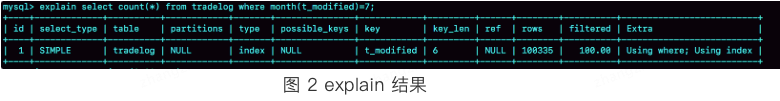
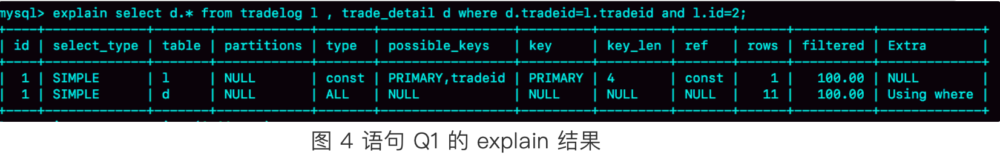
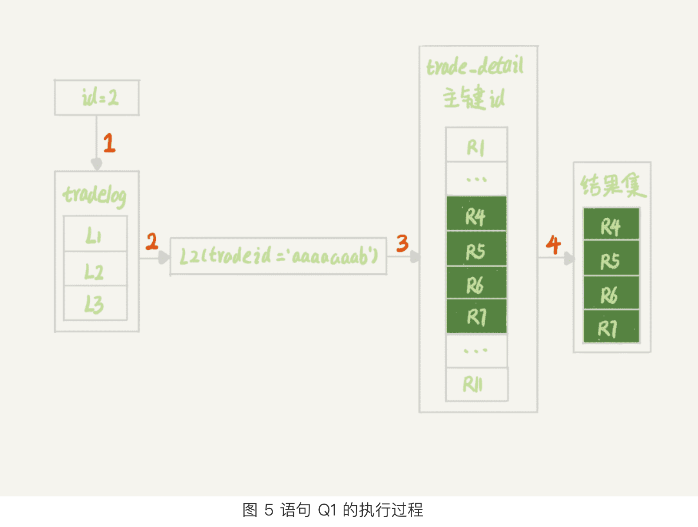
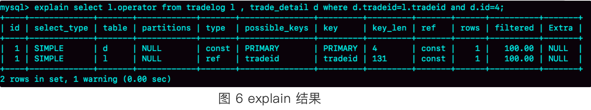
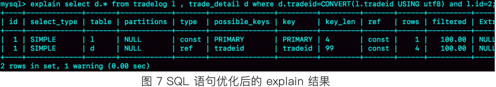

示例表：  
```sql
mysql> CREATE TABLE `tradelog` (
  `id` int(11) NOT NULL,
  `tradeid` varchar(32) DEFAULT NULL,
  `operator` int(11) DEFAULT NULL,
  `t_modified` datetime DEFAULT NULL,
  PRIMARY KEY (`id`),
  KEY `tradeid` (`tradeid`),
  KEY `t_modified` (`t_modified`)
) ENGINE=InnoDB DEFAULT CHARSET=utf8mb4;
```
# 案例一：条件字段函数处理
结论：条件字段使用函数会导致全索引扫描，无法按照B+树本身的有序特性加速搜索   
```sql
mysql> select count(*) from tradelog where month(t_modified)=7;
```
   
从执行计划中可以看出来sql查询进行了全表扫描   
修改：   
```sql
mysql> select count(*) from tradelog where
    -> (t_modified >= '2016-7-1' and t_modified<'2016-8-1') or
    -> (t_modified >= '2017-7-1' and t_modified<'2017-8-1') or 
    -> (t_modified >= '2018-7-1' and t_modified<'2018-8-1');
```
结论：对索引字段做函数操作，可能会破坏索引值的有序性，因此优化器就决定放弃走树搜索功能      

不过优化器在个问题上确实有“偷懒”行为，即使是对于不改变有序性的函数，也不会考虑使用索引。
比如，对于 select * from tradelog where id + 1 = 10000 这个 SQL 语句，这个加 1 操作并不会改变有序性，但是 MySQL 优化器还是不能用 id 索引快速定位到 9999 这一行。
所以，需要你在写 SQL 语句的时候，手动改写成 where id = 10000 -1 才可以
# 案例二：隐式类型转换
```sql
mysql> select * from tradelog where tradeid=110717;
```
现象：上述sql中tradeid本来是有索引的，但是查询的时候发现并没有触发索引，还是进行的全表扫描  
原因：本来tradeid字段是字符串，但是sql中传入的确实数字，这就导致sql真正执行的时候这个数字需要转换为字符串，真正执行的sql如下：   
```sql
mysql> select * from tradelog where  CAST(tradid AS signed int) = 110717;
```
这就触发了案例一中的原则，所以无法执行索引查询了
# 案例三：隐式字符编码转换
假设系统里还有另一个表trade_detail
```sql
mysql> CREATE TABLE `trade_detail` (
  `id` int(11) NOT NULL,
  `tradeid` varchar(32) DEFAULT NULL,
  `trade_step` int(11) DEFAULT NULL, /* 操作步骤 */
  `step_info` varchar(32) DEFAULT NULL, /* 步骤信息 */
  PRIMARY KEY (`id`),
  KEY `tradeid` (`tradeid`)
) ENGINE=InnoDB DEFAULT CHARSET=utf8;
```
（注意，这个表和tradelog表的字符集不一样，一个是utf8，一个是utf8mb4）   
此时进行sql查询，如下：
```sql
mysql> select d.* from tradelog l, trade_detail d where d.tradeid=l.tradeid and l.id=2; /* 语句 Q1*/
```
查看执行计划：  

第一行显示优化器在查询tradelog表的时候使用了主键索引，rows=1，表示只扫描了一行   
第二行，ky=NULL，表示没有用上trade_detail表的tradeid索引，进行了全表扫描。  
但是明明这个字段有索引，为什么优化器没有使用呢？其实就是因为两个关联字段的字符编码不一样     
sql执行步骤以及未使用索引的具体原因：   
  
步骤：
1. 根据id在tradelog表中找到id=2这一行L2；
2. 从L2中取出tradeid字段的值；
3. 根据tradeid的值去trade_detail表中查找匹配的行，执行计划中key=NULL表示这个过程是通过主键索引的方式，一行一行的判断tradeid的值是否匹配。
问题就出在第三步，由于字符编码不同，**按照mysql的字符集转换规则，utf8的字符集需要转换成utf8mb4**，由于此时tradeid是utf8编码的，所以实际第3步的sql应该如下：   
```sql
mysql> select * from trade_detail where tradeid=$L2.tradeid.value; 
```
然后由于字符编码不同，真正执行时sql会使用函数来转换字符编码，如下:
```sql
select * from trade_detail  where CONVERT(traideid USING utf8mb4)=$L2.tradeid.value; 
```
好了，又变成了案例一中的场景，索引因此失效。所以，真正造成索引失效全表扫描的原因是，**当联结查询的关联字段字符集编码不一致的时候，连接过程中要求在被驱动表的索引字段上加函数操作进行字符编码转换**          
## 如何优化？
两个优化思路：  
1. 修改两个表的字符编码一致
2. 修改sql语句将函数转移至条件的值中，即把要查询的条件的结果进行字符转换，具体执行如下：
* 修改驱动表，使得utf8->utf8mb4的转码过程发生在条件值上
* mysql>select l.operator from tradelog l , trade_detail d where d.tradeid=l.tradeid and d.id=4;

这个语句中trade_detail成了驱动表，且第二次的查询操作也使用上了索引，根据上述知识，第二次的查询实际上就是 select operator from tradelog  where traideid =$R4.tradeid.value;
然而因为此处traideid本来就是utf8mb4编码的，所以不需要函数转换，目标值$R4.tradeid.value是uft8编码的，需要转换，所以最终的sql是 select operator from tradelog  where traideid =CONVERT($R4.tradeid.value USING utf8mb4);
由于函数没有建立在查询条件上，所以此时可以使用索引     
**最终的优化**  
```sql
mysql> select d.* from tradelog l , trade_detail d where d.tradeid=CONVERT(l.tradeid USING utf8) and l.id=2;
```

在不修改sql逻辑的前提下，主动将编码统一，转换驱动表联结字段的编码值，避免查询操作在被驱动表上的字符编码转换。   
## 知识补充：mysql如何选择驱动表
在联结查询中，区分驱动表和被驱动表是一个重要的概念，它影响查询的执行计划和性能。让我们以您提供的 SQL 为例进行分析：
```sql
SELECT d.*
FROM tradelog l, trade_detail d
WHERE d.tradeid = l.tradeid AND l.id = 2;
```
在这个查询中：

驱动表（Driving Table）：
通常，驱动表是首先被访问的表，它决定了连接操作的基础集合。

被驱动表（Driven Table）：
被驱动表是根据驱动表的每一行去匹配的表。

区分驱动表和被驱动表的因素：

WHERE 子句中的条件：

l.id = 2 是一个对 tradelog 表的过滤条件。这意味着数据库可能会先筛选 tradelog 表，使其成为驱动表。
索引情况：

如果 tradelog.id 上有索引，那么选择 tradelog 作为驱动表会更有效率。
如果 trade_detail.tradeid 上有索引，那么无论哪个表作为驱动表都可能是高效的。
表的大小：

通常，较小的表（在应用过滤条件后）会被选为驱动表。
连接列的基数：

如果 tradeid 在 tradelog 中的基数较低（即重复值多），而在 trade_detail 中基数较高，那么选择 tradelog 作为驱动表可能更有效。
优化器的选择：

现代数据库的查询优化器会考虑多种因素来决定哪个表作为驱动表，包括表统计信息、索引、数据分布等。
在这个特定的查询中：

由于条件 l.id = 2 可能会显著减少 tradelog 表中的行数，所以 tradelog 很可能被选为驱动表。
查询会首先在 tradelog 表中找到 id = 2 的行，然后用这些行的 tradeid 去 trade_detail 表中查找匹配的行。
然而，最终的执行计划还是取决于数据库优化器的决定。您可以使用 EXPLAIN 命令来查看实际的执行计划，以确定哪个表被选为驱动表。

总之，虽然我们可以根据查询结构和条件推测可能的驱动表，但实际的选择还是由数据库优化器基于各种因素做出的决定。
