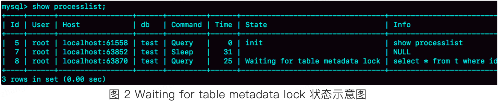
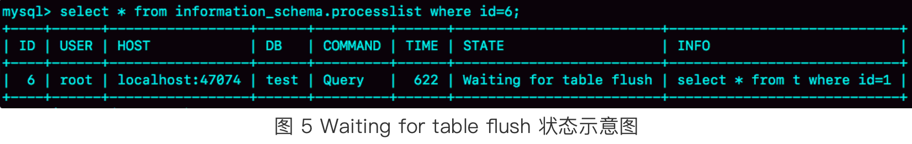
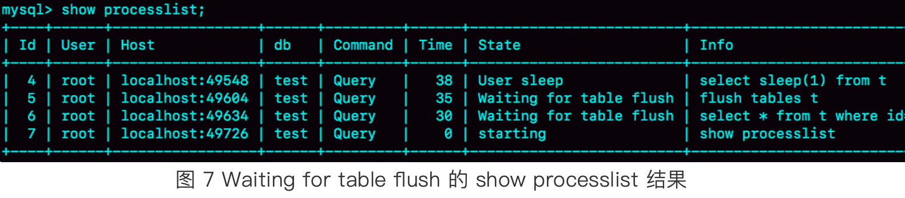
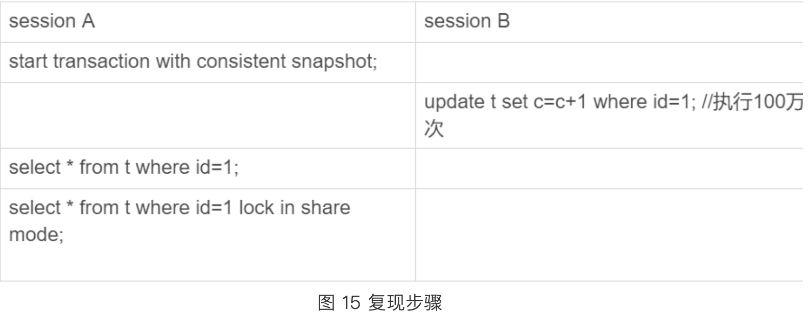

表信息，两个字段，十万行数据
```sql
mysql> CREATE TABLE `t` (
  `id` int(11) NOT NULL,
  `c` int(11) DEFAULT NULL,
  PRIMARY KEY (`id`)
) ENGINE=InnoDB;
 
delimiter ;;
create procedure idata()
begin
  declare i int;
  set i=1;
  while(i<=100000)do
    insert into t values(i,i);
    set i=i+1;
  end while;
end;;
delimiter ;
 
call idata();
```
# 第一类，查询长时间不返回 
```sql
mysql> select * from t where id=1;
```

## 等MDL锁
show processlist命令查看如下 Waitiong for table metadata lock 的示意图：

从图中可以知道，现在正有一个线程在表t上请求或者持有MDL写锁，把select语句堵住了。
复现：

sessionA通过lock table持有表t的MDL写锁，而sessionB的查询需要获取MDL读锁，所以，sessionB进入等待状态   
## 等flush
```sql
mysql> select * from information_schema.processlist where id=1;
```
上述sql查询出得结果如下：

这个状态表示的是，现在有一个线程正要对表t做flush操作。  
目前对flush的理解：关闭表   
比如select语句查询的过程中可以理解为将一个表 “打开” 了，flush操作想要将表关闭，但是查询操作的事务时间非常的长，导致flush操作的当前事务无法关闭表，造成了flush命令被堵住了。    
场景复现：   

解决：   

可以看到是select sleep(1) from t 造成的阻塞，kill掉就好了   
## 等行锁   
```sql
mysql> select * from t where id=1 lock in share mode; 
```
由于访问id=1这个记录时候要加读锁，如果这个时候该行上已经有一个写锁，我们的select语句就会被堵住   
复现：   

如果想要解决这种情况就要把那个占用写锁的事务kill   
# 第二类：查询慢  
有如下事务执行过程   

如上执行过程中会出现如下状况：   
sessionA的第一次查询十分慢，但是第二次的却很快  
原因：A先开启了事务，B执行了一个100万次的更新操作，由于第一次查询是一致性读，所以他不能读到最新的更新结果，这个时候就要依赖undo log找到100万次更新之前的数据然后读出来，这个过程十分的慢；
而第二次查是一个当前读，只需要读取最新的数据就好，所以十分快   


