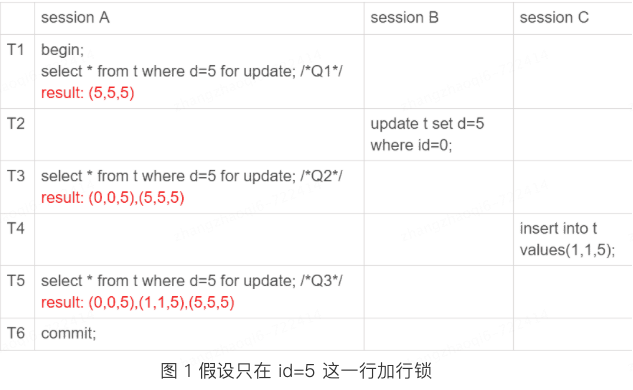
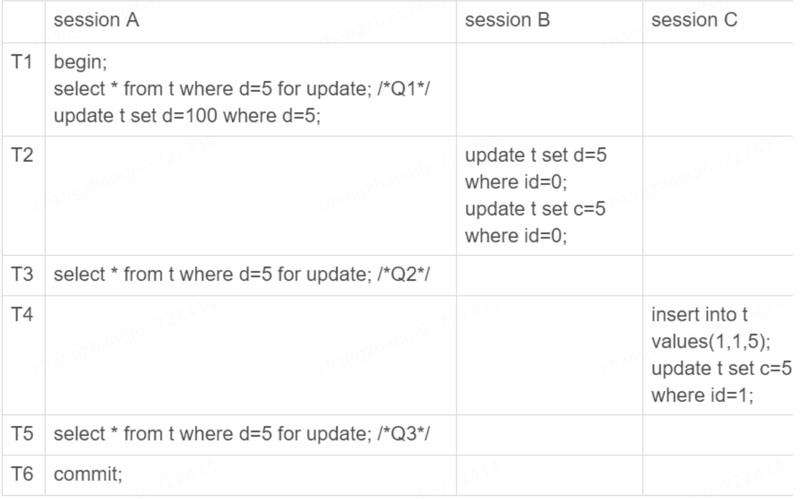

# 本章所使用数据
```sql
CREATE TABLE `t` (
  `id` int(11) NOT NULL,
  `c` int(11) DEFAULT NULL,
  `d` int(11) DEFAULT NULL,
  PRIMARY KEY (`id`),
  KEY `c` (`c`)
) ENGINE=InnoDB;
 
insert into t values(0,0,0),(5,5,5),
(10,10,10),(15,15,15),(20,20,20),(25,25,25);
```
sql创建完之后表中的数据情况  
0   0   0 
5   5   5
10  10  10
15  15  15  
20  20  20  
25  25  25 
# 幻读概念
幻读：再一次事务中读取数据，两次读取出来的数据行数不一样，就好像出现了幻觉一样  
# 造成幻读的原因
在可重复读的隔离级别下，普通的查询是快照读，是不会看到别的事务插入的数据的。因此，幻读只有在“当前读”的情况下才会出现；产生的幻读的原因就是锁的粒度不够大，没有锁住数据行之间的间隙，导致出现了一条在之前查询中没有出现过的
数据；
# 解决幻读的方法
间隙锁；next-key lock
# 幻读示例
  
假设有上述事务执行过程：  
1. T1时刻session A查询 d=5的所有数据并试图加上排他锁，此时锁住了(5,5,5) 这一行
2. T2时刻session B更新id=0的数据行中的d=5，此时第一行和第二行的数据中d都变成了5
3. T3时刻session A再次查询d=5的所有数据并加上排他锁，此时锁住了两行数据(0,0,5),(5,5,5)
4. T4时刻session C插入数据(1,1,5)
5. T5时刻session A再次查询d=5的数据，发现这时候有三行都满足d=5的条件
上述过程中就明显出现了幻读的情况，但是按照事务的可见性规则来说，上面三个sql语句的返回结果都没有问题，因为for update就是要当前读来获取最新值。所以真的没有问题吗？不，肯定是有问题的
# 幻读带来的问题
## 破坏了语义
首先破坏了语义，比如上述的sql，session A在T1时刻就声明了，其实他想要把所有d=5的行都锁起来，不准别的事务进行读写操作，而实际上，这个语义就被破坏了
## 破坏了数据的一致性
我们知道，锁的设计是为了保证数据的一致性。而这个一致性，不只是数据库内部数据状态的一致性，还包含了数据和日志在逻辑上的一致性，将上述的事务执行过程稍加修改，如下：
  
执行完上述过程后，数据库里的结果：   
1. 经过T1时刻，id=5这条数据变成了(5,5,100)，当然这个结果最终是在T6时刻提交的
2. 经过T2时刻，id=0这行，变成了(0,5,5)
3. 经过T4时刻，表里面多了一行（1，5，5）
这样看似乎也没什么问题，但是从binlog角度在看下上述过程   
T2时刻，session B事务提交，写入了两条数据；  
T4时刻，session C事务提交，写入了两条数据；  
T6时刻，session提交了事务，写入了 update t set d=100 where d=5这条语句  
上述过程放在一起，如下:  
```sql
update t set d=5 where id=0; /*(0,0,5)*/
update t set c=5 where id=0; /*(0,5,5)*/
 
insert into t values(1,1,5); /*(1,1,5)*/
update t set c=5 where id=1; /*(1,5,5)*/
 
update t set d=100 where d=5;/* 所有 d=5 的行，d 改成 100*/
```
最后这个binlog拿去任何库执行，结果都会变成(0,5,100)、(1,5,100) 和 (5,5,100)。明显和表中数据不一样，这时候就发生了严重的数据不一致情况。    
### 原因
造成上述问题的原因就是因为锁只锁了本行，如果新增的数据更新的不是上锁的哪一行就会出现问题。
# 如何解决幻读
next-key lock = 间隙锁（Gap Lock）+行锁   
锁住行间隙和具体行  
# 间隙锁的确定
间隙锁锁住的范围很大，很容易引起锁冲突导致死锁  
