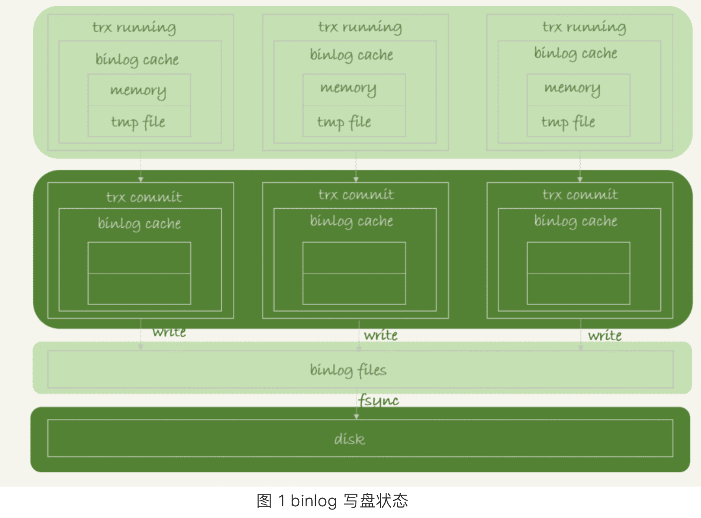

# 原理
binlog + redo log + undo log   
根据WAL得出的结论：**只要redo log和binlog保证持久化到磁盘，就能确保mysql异常重启后，数据可以恢复**
# binlog的写入机制  
事务执行过程中，先把日志写到binlog cache，事务提交的时候，再把binlog cache写到binlog 文件中    
* 系统给每个线程都分配了binlog cache但是所有线程公用一个binlog文件，binlog_cache_size参数控制单个线程内binlog cache占用内存的大小，如果超过这个值就要暂存到磁盘  
* binlog文件系统也有自己的page cache，binlog cache中的内容会先写入到page cache中，然后在被持久化到磁盘中，过程如下图所示：
  
可以看到，每个线程有自己的binlog cache，但是共用一份binlog文件。图中的write就是指把日志写入到文件系统的page cache，并没有把数据持久化到磁盘，所以数据比较快。图中的fsync才是将数据持久化
到磁盘的过程。一般情况下，认为fsync才占用磁盘的IOPS。write和fsync的时机由参数sync_binlog控制。  
  * sync_binlog=0的时候，表示每次提交事务都只write，不fsync；  
  * sync_binlog=1的时候，表示每次提交事务都会执行fsync
  * sync_binlog=N(N>1)的时候，表示每次提交事务都write，但积累N个事务后会fsync  
