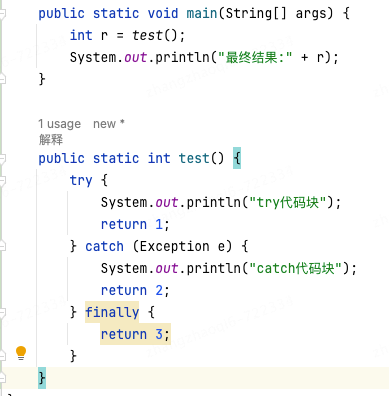

# JAVA
## 1.泛型和Object有什么区别？平时编码过程中如何选择使用这两个特性？
1.泛型：  
优点：  
* 类型安全：编译时类型检查，可以在编译阶段发现类型错误。object只能在运行时检查，如果类型转换出错直接GG
* 消除类型转换：不需要显式的类型转换
* 可读性更好：代码更清晰，意图更明显
* 代码复用：可以编写更通用的算法和数据结构  

2.Object  
优点：
* 灵活性：可以存储任何类型的对象
* 向后兼容：在泛型引入之前的旧代码中广泛使用  

泛型擦除：  
在编译阶段会进行所谓的“类型擦除”（Type Erasure），将所有的泛型表示（尖括号中的内容）都替换为具体的类型（其对应的原生态类型），就像完全没有泛型一样。   

使用场景：    
泛型提供了类型安全和代码复用的优势，应该是首选。只有在确实需要处理未知类型或与旧系统交互时，才考虑使用Object。在现代Java编程中，泛型的使用远比Object普遍，因为它能在保持灵活性的同时提供更好的类型安全性。   
当确实需要处理任何可能的类型且无法预知具体类型时，或者那种需要使用反射等的极高灵活性的场景中在考虑使用Object

参考：
https://www.yuque.com/hollis666/xx5hr2/syhevb

## 2.创建线程的几种方式？平时项目中可以使用这些方式创建线程吗？
1. 继承Thread类创建线程
2. 实现Runnable接口创建线程
3. 通过Callable和FutureTask创建线程
4. 通过线程池创建线程

https://www.yuque.com/hollis666/xx5hr2/gmgb2a

## 3.线程池都有哪几种？平时使用哪种线程池，是否使用过Spring框架中提供的线程池？如何使用？线程数设置多少合适？如何等待一批线程的执行结果或者说如何实现一批线程执行完成后在继续后面的逻辑执行？
countDownLaunch和CompletableFuture,CompletableFuture的实现:https://www.yuque.com/hollis666/xx5hr2/qgrygdsu04a6vfzw
## 4.接口和抽象类有什么区别？一般在什么场景下使用抽象类？
职责不同：接口和抽象类的职责不一样。接口主要用于制定规范，因为我们提倡也经常使用的都是面向接口编程。而抽象类主要目的是为了复用，比较典型的就是模版方法模式。  
所以当我们想要定义标准、规范的时候，就使用接口。当我们想要复用代码的时候，就使用抽象类   

一般在实际开发中，我们会先把接口暴露给外部，然后在业务代码中实现接口。如果多个实现类中有相同可复用的代码，则在接口和实现类之间加一层抽象类，将公共部分代码抽出到抽象类中。这就是模版方法模式的基本使用，这是一个很好
的理解接口、抽象类和实现类之间关系的设计模式。   

参考：https://www.yuque.com/hollis666/xx5hr2/bit2y4
## 5.抽象类是否可以添加@Component注解，将抽象类交给spring管理？是否可以使用Autowired向抽象类中注入其他对象？  
不可以，抽象类不能够实例化，所以spring无法去管理抽象类，无法实例化，自然也无法注入依赖。  
## 6.什么是SPI，和API有什么区别？
**API用于定义调用接口，而SPI用于定义和提供可插拔的实现方式**；API面向普通开发者，提供一组功能，是他们可以利用一个库或者一个框架来实现具体的功能。而SPI是面向哪些希望扩展或定制基础服务的开发者的，他定义一种机制，让其他开发者可以提供新的
实现或扩展现有的功能。比如请求拦截器中各种filter的实现  
## try-catch-finally中都存在return语句，最终是哪一个返回
  
答案：如果finally中存在return，最终都是返回finally中的；如果finally中不存在return，则看catch逻辑是否执行到，执行到就返回catch中的，不然就是try中的返回
# Spring
# Maven相关
## 1.Maven的依赖原则是什么？如何解决冲突？
答案：
* 依赖原则
1. 依赖路径最短优先原则  
  
由于X(2.0)路径最短，所以使用X(2.0)  
2. 声明顺序优先原则  
  
在POM中最先声明的优先，上面的两个依赖如果先声明B，那么最后使用X(1.0)
3. 覆写优先原则
子POM内声明的依赖优先于父POM中声明的依赖。 
* 解决冲突    
mvn dependency:tree，查看依赖树，然后exclude排除掉冲突的包。可以使用插件 maven helper。
## 2.maven是否可以指定打包类型以及包里的文件结构目录？比如按照某种规定打一个zip包出来
可以，使用maven build的插件+assembly.xml，可以打jar、zip等等

# Git相关
## 1.merge、rebase有什么区别？平时自己怎么用这两个命令？
merge一般用于特性分支合并到主分支的过程；rebase一般用于主分支的变动合并到自己特性分支的过程；
merge：会增加一次commit，等于是把被merge分支的所有提交重新加到当前分支的commit头部；
rebase：不会多增加commit，等于是把之前的commit按照顺序合并到当前的分支，提交记录更加的清晰平滑  
## 2.之前是怎么做分支开发的？有没有release分支的概念？
听听用户之前怎么使用git的，看看有没有什么有问题的地方  

# 部门相关内容
## 1.CI/CD了解吗？
https://pdai.tech/md/interview/x-interview-2.html#_15-3-ci-cd
## 2.是否了解SCA
## 3.是否了解开源协议
